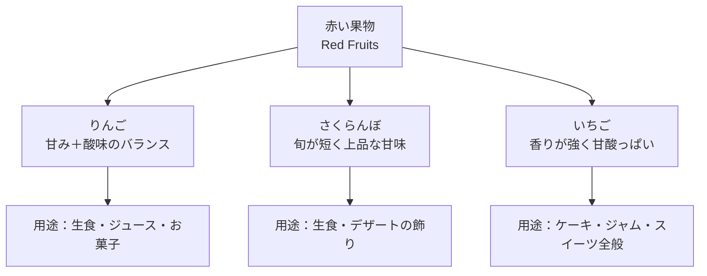

# 赤い果物の説明


### 赤い果物とは

赤い果物には，甘味，酸味のバランスなど味にも特徴がある．ここではりんご・さくらんぼ・いちごの3種類を例に説明する．

```text
# 赤い果物について
## 種類ごとの特徴
### 栄養・色・季節
```

## 赤い果物の特徴まとめ
### 代表的な赤い食べ物
赤い果物にもさまざまな種類があるが，ここでは，特に知られる3種類を取り上げる．
> 説明文
・りんご
・さくらんぼ
・いちご

### りんご（Apple）
・甘味と酸味のバランスがよい
・シャキッとした食感
・生でも加工しても美味しい（アップルパイなど）
> 説明文
りんごは保存しやすく，幅広い料理やお菓子に使われる万能な果物である．

```C
名前: りんご
色: 赤（品種により黄色や緑も存在）
味: 甘みと酸味のバランスがよい
食感: シャキッとしている
主な用途: 生食 / ジュース / ジャム / 焼き菓子 / サラダ
旬: 秋〜冬（品種による）
```
### さくらんぼ（Cherry）
・小粒で食べやすい
・甘味が強く上品な味
・旬の時期が短い

> 説明文
さくらんぼは鮮度が重要と言われており，収穫直後が最も美味しいとされる．

```C
名前: さくらんぼ
色: 明るい赤〜濃い赤
味: 甘味が強く上品
食感: みずみずしい・弾力がある
主な用途: 生食 / ケーキの飾り / コンポート / ジュース
旬: 初夏（6〜7月頃）
```

### いちご
・甘酸っぱく香りが強い
・ビタミンCが豊富
・スイーツとの相性が抜群

> 説明文
いちごは，赤い色と甘酸っぱい風味が特徴の果物であり，そのまま食べても美味しい他，スイーツとの相性がよいためケーキやジャムなどの用途でも親しまれている．

```C
名前: いちご
色: 鮮やかな赤
味: 甘酸っぱい・香りが強い
食感: やわらかくジューシー
主な用途: 生食 / ケーキ / ジャム / スムージー / デザート全般
旬: 冬〜春（12〜5月頃）
```

### 3つの果物の比較
・りんご
```C
- 食感: しゃきっとした歯ごたえで満足感がある
- 保存性: 日持ちしやすく長期保存に向く
- 用途: 生食・加熱どちらもOK。お菓子・料理・ジュースなど用途の幅が広い
- 備考: 種類によって甘さや酸味の強弱が大きく異なる
```

さくらんぼ
```C
- 季節性: 旬が短く、その短さが特別感を演出する
- 味: 上品で軽やかな甘味が特徴
- 食べ方: そのまま食べるのが主流（種に注意）
- 用途: デザートの飾りや贈答用に人気（見た目が華やか）
```

いちご
```C
- 香り: 甘酸っぱい強い香りが魅力の一つ
- 見た目: 鮮やかな赤でかわいらしく目を引く
- 用途: ケーキやパフェなどスイーツの主役になりやすい
- 栄養: ビタミンCが豊富でヘルシーなイメージ
```


### 画像の表示

### りんご  


### さくらんぼ


### いちご


## タスクリスト
- [x] りんごの説明を書く
- [x] さくらんぼの説明を書く
- [x] いちごの説明を書く
- [x] 画像の追加
- [ ] 詳細比較表の作成


 

### Mermaid

すでに授業で紹介している，Mermaidによる図も使用できる．
簡単な図しか描画できないが編集が簡単なので，設計・検討段階に下書きツールとして使用すると良い．
